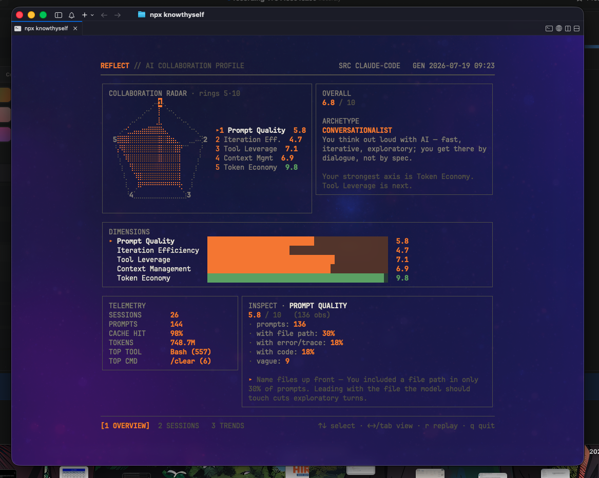
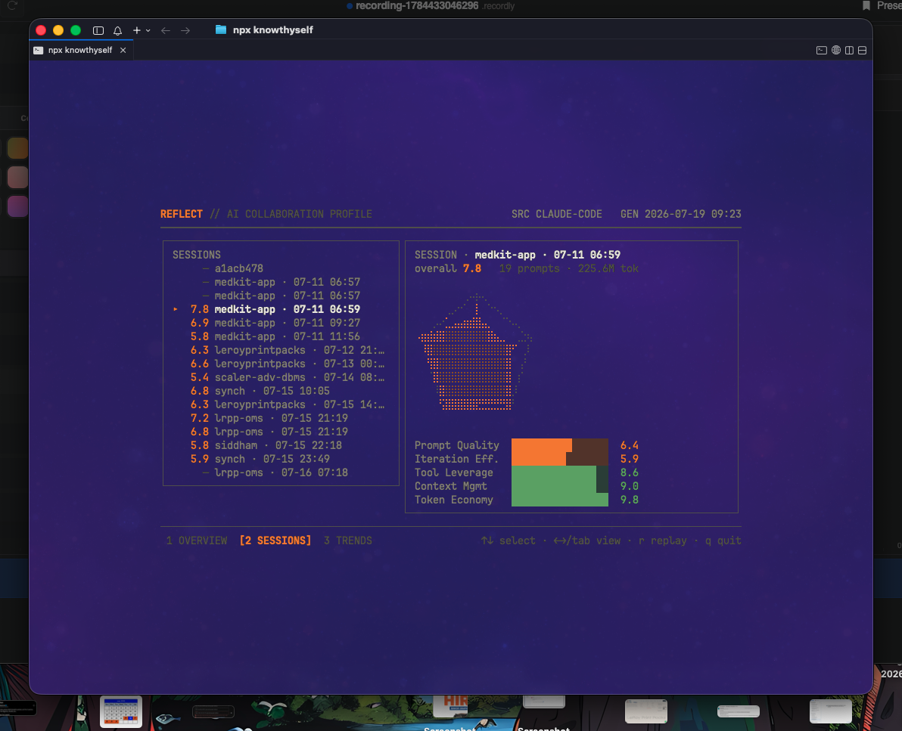
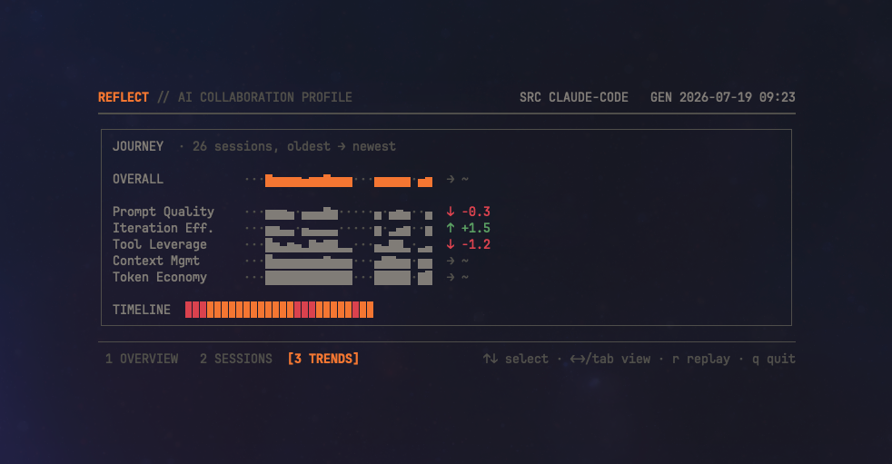

<div align="center">


### See how you actually collaborate with your AI coding assistant.

knowthyself reads the session logs your AI coding tools already keep on disk and turns them into a clear picture of how you work. Not the code you ship, but the quality of the conversation behind it: your strengths, your habits, and the shape of your collaboration. Everything runs locally. Nothing leaves your machine unless you opt into `--deep-eval` with your own API key.

[](https://www.npmjs.com/package/knowthyself)
[](LICENSE)
[](https://go.dev)

</div>

## Demo

<div align="center">


</div>

## Install

### npm (recommended)

```sh
npm install -g knowthyself
knowthyself
```

Or run it once without installing anything:

```sh
npx knowthyself
```

The package installs the `knowthyself` command. On install it downloads the prebuilt binary for your platform from the GitHub release, so no Go toolchain is required.

### Direct download

Grab a prebuilt binary for your OS and architecture from the [releases page](https://github.com/siddham-jain/knowthyself/releases), unpack the archive, and put `knowthyself` on your PATH.

### From source

Requires Go 1.25 or newer.

```sh
git clone https://github.com/siddham-jain/knowthyself
cd knowthyself
make build   # produces ./knowthyself
```

More package managers (Homebrew, Scoop, winget, AUR) are planned.

## Usage

```sh
knowthyself            # sync, then open the interactive dashboard
knowthyself --json     # print the raw profile as JSON (piped output stays scriptable)
knowthyself --sync     # refresh the local cache, print a summary, then exit
knowthyself --version  # print the version
```

knowthyself reads `~/.claude` by default. Override the location with `CLAUDE_CONFIG_DIR`. The first time you run it on a real terminal, it asks whether you want to profile before it reads anything. Decline and it exits without touching your history. If there is no Claude history yet, it greets you with a friendly starting screen instead of an error.

On a real terminal the dashboard boots with a short power on animation, then lets you explore:

| Key | Action |
|:---:|:-------|
| `↑` `↓` or `j` `k` | move the cursor (select a dimension or session) |
| `←` `→` or `tab` | switch view |
| `1` `2` `3` | jump to Overview, Sessions, or Trends |
| `r` | replay the boot animation |
| `q` or `esc` | quit |

The layout reflows to your terminal size and never overflows the screen. Piped or non interactive output falls back to a single static frame.

## Screens

**Overview.** A radar of the five dimensions with an evidence inspector. Select any axis to see the exact counts behind its score, plus the matching tip.

<div align="center"></div>

**Sessions.** Drill into any single session for its own mini radar and per dimension bars.

<div align="center"></div>

**Trends.** Chronological sparklines per dimension, so you can answer the one question that matters: am I getting better?

<div align="center"></div>

## The five dimensions

Every session is graded on five deterministic dimensions, then averaged into an overall score.

| Dimension | What it measures |
|:----------|:-----------------|
| **Prompt Quality** | Whether your prompts carry concrete signal: file paths, error traces, and specific asks. |
| **Iteration Efficiency** | How directly you reach a result: turns to resolution, clarification loops, and re prompts. |
| **Tool Leverage** | How well you use the platform: tool diversity, sub agents, skills, and slash commands. |
| **Context Management** | Your context hygiene: compaction, `/clear` discipline, and cache reuse. |
| **Token Economy** | How much value you extract per token: cache hit rate, output to input ratio, and tokens per task. |

## Collaboration archetypes

After grading the dimensions, knowthyself names the persona whose signature best matches the shape of your radar. The match uses cosine similarity over the dimensions it actually graded, so the result is deterministic, reproducible, and never rests on a single axis in isolation.

| Archetype | Signature |
|:----------|:----------|
| **Architect** | You plan in precise strokes. Grounded briefs and clean context, with the work specced before a line is written. |
| **Surgeon** | Precise, minimal incisions. You say exactly what is needed and land it in a few clean moves. |
| **Conductor** | You direct a whole orchestra of tools, agents, and servers, delegating the work in concert. |
| **Pathfinder** | You map unknown territory by probing. You read, search, and trace until its shape appears. |
| **Economist** | You extract maximum signal per token. Cache savvy, context stable, and quietly cost lean. |
| **Marathoner** | You go deep for hours and keep context clean the whole way. Sustained, disciplined sessions. |
| **Conversationalist** | You think out loud with AI. Fast, iterative, exploratory. You get there by dialogue, not by spec. |
| **Generalist** | No single mode. You are fluent across the board and adapt to whatever the task needs. |

Before there is enough history to judge, knowthyself shows a **Newcomer** placeholder and invites you to come back once you have collaborated a bit more.

## How it works

Scores are one hundred percent deterministic heuristics computed on language agnostic structural signals: paths, code fences, error patterns, and turn shape. Prompts written in English, Hindi, or Hinglish are graded on communication quality, not on English proficiency. Every score is explainable, since the underlying counts are retained and shown in the evidence inspector.

The optional `--deep-eval` flag uses your own API key to phrase the qualitative tips more naturally. It never changes a score.

## Contributing

Issues and pull requests are welcome. Build and test locally with:

```sh
make build   # produces ./knowthyself
make test    # unit and golden tests
```

## License

MIT. See [LICENSE](LICENSE).
